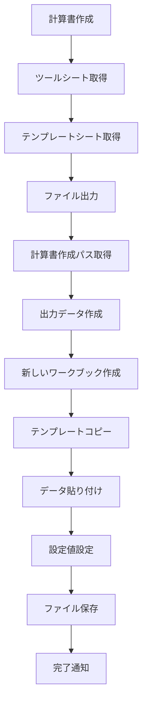
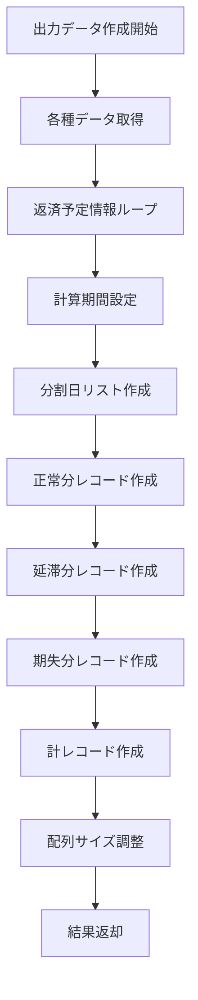

# 利息計算書作成ツール 詳細設計書

## 1. システム概要

### 1.1 目的
本ツールは、借入金に対する利息計算書を自動作成するExcel VBAマクロシステムです。返済予定情報、入出金情報、利率情報を基に、期間別の詳細な利息計算を行い、Excel形式の計算書を自動出力します。

### 1.2 主要機能
- **データ取得・検証機能**: 各種入力データの取得と妥当性検証
- **期間分割計算機能**: 複数の条件による計算期間の自動分割
- **利息計算機能**: 正常分・延滞分・期失分の利息計算
- **Excel出力機能**: テンプレートベースの計算書ファイル生成
- **エラーハンドリング機能**: 包括的なエラー処理と通知

### 1.3 技術仕様
- **開発言語**: VBA (Visual Basic for Applications)
- **対象環境**: Microsoft Excel 2016以降
- **ファイル形式**: .xlsm (マクロ有効ワークブック)
- **出力形式**: .xlsx (Excel ワークブック)

## 2. アーキテクチャ設計

### 2.1 ファイル構成
```
vba-files/
├── Module/
│   └── Module1.bas           # メイン処理モジュール (1,615行)
├── Class/
│   ├── Sheet1.cls            # シートクラス
│   └── ThisWorkbook.cls      # ワークブッククラス
└── 利息計算書作成マクロ.xlsm    # メインワークブック
```

### 2.2 モジュール構成

#### 2.2.1 定数定義セクション
```vba
' 入出金情報関連定数
Private Const 入出金開始行 As Long = 46
Private Const 入出金日列 As Long = 2
Private Const 摘要列 As Long = 3
Private Const 入出金金額列 As Long = 4
Private Const 残高列 As Long = 5
Private Const 約定返済元金列 As Long = 6

' 期失日関連定数
Private Const 期失日列 As Long = 3
Private Const 期失日行 As Long = 25

' 借入利率関連定数
Private Const 借入利率列 As Long = 2
Private Const 借入利率開始日列 As Long = 3
Private Const 借入利率開始行 As Long = 29

' 遅延損害金利率関連定数
Private Const 遅延損害金利率列 As Long = 2
Private Const 遅延損害金利率開始日列 As Long = 3
Private Const 遅延損害金利率開始行 As Long = 15
```

#### 2.2.2 主要関数一覧

| 関数名 | 機能 | 戻り値型 | 行数 |
|--------|------|----------|------|
| `計算書作成` | メイン処理実行 | Sub | 20 |
| `ファイル出力` | 計算書ファイル出力 | Sub | 120 |
| `出力データ作成` | 計算データ作成 | Variant | 400 |
| `返済予定情報取得` | 返済予定データ取得 | Variant | 80 |
| `入出金情報取得` | 入出金データ取得 | Variant | 100 |
| `入出金情報全体取得` | 全入出金データ取得 | Variant | 80 |
| `借入利率取得` | 借入利率データ取得 | Variant | 60 |
| `遅延損害金利率取得` | 遅延損害金利率データ取得 | Variant | 60 |
| `返済履歴情報取得` | 返済履歴データ取得 | Variant | 50 |
| `期失日取得` | 期失日取得 | Date | 15 |
| `計算書の作成パス取得` | 出力パス取得・検証 | String | 25 |
| `計算期間最初日取得` | 計算開始日算出 | Date | 80 |
| `分割日ソート` | 日付配列ソート | Sub | 15 |

## 3. データ設計

### 3.1 入力データ仕様

#### 3.1.1 返済予定情報 (35行目～)
| 列 | セル | 項目名 | データ型 | 必須 | 検証ルール | 備考 |
|----|------|--------|----------|------|------------|------|
| C | C35～ | 返済予定日 | Date | ○ | IsDate() | 空白で終了判定 |
| D | D35～ | 返済元金 | Double | △ | IsNumeric() | 空白時は0設定 |
| - | - | 返済元金累計 | Double | - | 自動計算 | 累積計算値 |

#### 3.1.2 入出金情報 (46行目～)
| 列 | セル | 項目名 | データ型 | 必須 | 検証ルール | 備考 |
|----|------|--------|----------|------|------------|------|
| B | B46～ | 入出金日 | Date | ○ | IsDate() | 空白で終了判定 |
| C | C46～ | 摘要 | String | ○ | - | 「返済分」で終わる行は除外 |
| D | D46～ | 入出金金額 | Double | ○ | IsNumeric() | - |
| E | E46～ | 残高 | Double | ○ | IsNumeric() | - |
| F | F46～ | 延滞中約定返済元金合計 | Double | △ | IsNumeric() | 空白時は前行値継承 |

#### 3.1.3 借入利率情報 (29行目～)
| 列 | セル | 項目名 | データ型 | 必須 | 検証ルール | 備考 |
|----|------|--------|----------|------|------------|------|
| B | B29～ | 借入利率 | Double | ○ | IsNumeric() | 空白で終了判定 |
| C | C29～ | 開始日 | Date | △ | IsDate() | 空白時は1900/1/1設定 |

#### 3.1.4 遅延損害金利率情報 (15行目～)
| 列 | セル | 項目名 | データ型 | 必須 | 検証ルール | 備考 |
|----|------|--------|----------|------|------------|------|
| B | B15～ | 遅延損害金利率 | Double | ○ | IsNumeric() | 空白で終了判定 |
| C | C15～ | 開始日 | Date | △ | IsDate() | 空白時は1900/1/1設定 |

#### 3.1.5 返済履歴情報 (70行目～)
| 列 | セル | 項目名 | データ型 | 必須 | 検証ルール | 備考 |
|----|------|--------|----------|------|------------|------|
| B | B70～ | 日付 | Date | ○ | IsDate() | 空白で終了判定 |
| C | C70～ | 摘要 | String | ○ | - | 利息・遅延損害金判定用 |
| D | D70～ | 出金金額 | Double | ○ | IsNumeric() | - |

#### 3.1.6 設定値
| セル | 項目名 | データ型 | 必須 | 検証ルール | 備考 |
|------|--------|----------|------|------------|------|
| C6 | 顧客番号 | String | ○ | 非空白 | 出力ファイルに設定 |
| C7 | 計算書作成パス | String | ○ | Dir()でフォルダ存在確認 | 出力先パス |
| C10 | 手続理由 | String | ○ | 非空白 | - |
| C11 | 手続開始日 | Date | ○ | IsDate() | - |
| C22 | ローン口座ステータス | String | ○ | 非空白 | 期失処理に影響 |
| C25 | 期失日 | Date | ○ | IsDate() | 計算期間終了日決定 |
| E25 | 期失理由 | String | ○ | 非空白 | 出力ファイルに設定 |

### 3.2 出力データ仕様

#### 3.2.1 計算書レコード (A9セル～)
| 列 | 項目名 | データ型 | 内容 | 数式例 |
|----|--------|----------|------|--------|
| A | 通番 | Long | 連番 | 1, 2, 3... |
| B | ステータス | String | "正常", "延滞", "期失", "期失（劣後）" | - |
| C | イベント | String | "約定返済", "延滞", "破産", "内入" | - |
| D | 約定返済月 | String | "yyyy/mm", "計算中", "ー" | - |
| E | 対象元金 | Double | 計算対象元金 | - |
| F | 計算期間開始日 | Date | 計算開始日 | - |
| G | 区切り | String | "～" | - |
| H | 計算期間終了日 | Date | 計算終了日 | - |
| I | 計算日数 | Long | 日数計算結果 | =DATEDIF(F行,H行,"d")+1 |
| J | 利率 | Double | 適用利率 | - |
| K | 積数 | String | Excel数式 | =E行*J行*I行 |
| L | 利息金額 | String | Excel数式 | =ROUNDDOWN(K行/365,0) |
| M | 遅延損害金 | String | Excel数式 | =ROUNDDOWN(K行/365,0) |
| N | 借入日 | Date | 借入日 | - |
| O | 借入額 | Double | 借入額 | - |
| P | 返済日 | Date | 返済日 | - |
| Q | 元金_返済額 | Double | 元金返済額 | - |
| R | 利息_返済額 | Double | 利息返済額 | - |
| S | 遅損金_返済額 | Double | 遅延損害金返済額 | - |

#### 3.2.2 出力ファイル設定
| セル | 項目名 | 設定値 | 取得元 |
|------|--------|--------|--------|
| B4 | 顧客番号 | "顧客番号" + 顧客番号 | C6 |
| J2 | 手続開始日 | 手続開始日 | C11 |
| J3 | 期失日 | 期失日 | C25 |
| K3 | 期失理由 | 期失理由 | E25 |

## 4. 処理設計

### 4.1 メイン処理フロー



### 4.2 出力データ作成処理

#### 4.2.1 処理概要


#### 4.2.2 期間分割処理

**分割条件**:
1. 返済予定前月データの日付
2. 入出金情報の日付
3. 借入利率データの開始日
4. 遅延損害金利率データの開始日

**分割ロジック**:
```vba
' 1. 計算期間設定
期間開始日 = DateSerial(Year(返済予定当月データ(0)), Month(返済予定当月データ(0)), 1)
期間開始日 = DateAdd("m", -1, 期間開始日)
If 期間開始日 < 計算期間最初日 Then
    期間開始日 = 計算期間最初日
End If

期間終了日 = DateSerial(Year(返済予定当月データ(0)), Month(返済予定当月データ(0)), 1)
期間終了日 = DateAdd("d", -1, 期間終了日)

' 2. 期失日チェック
If 期間終了日 >= 期失日 Then
    If ローン口座ステータス = "期限切れ" Then
        期間終了日 = 期失日
    Else
        期間終了日 = DateAdd("d", -1, 期失日)
    End If
End If
```

### 4.3 利率適用ロジック

#### 4.3.1 借入利率取得
```vba
' 1. 同一日付検索
For k = 1 To UBound(借入利率データ, 1)
    If 借入利率データ(k, 2) = 計算期間開始日 Then
        利率 = 借入利率データ(k, 1)
        利率見つかった = True
        Exit For
    End If
Next k

' 2. 最大日付検索（同一日付がない場合）
If Not 利率見つかった Then
    Dim 最大日付 As Date
    最大日付 = DateSerial(1900, 1, 1)
    For k = 1 To UBound(借入利率データ, 1)
        If 借入利率データ(k, 2) < 計算期間開始日 And 借入利率データ(k, 2) > 最大日付 Then
            最大日付 = 借入利率データ(k, 2)
            利率 = 借入利率データ(k, 1)
        End If
    Next k
End If
```

#### 4.3.2 遅延損害金利率取得
- 借入利率と同様のロジックを適用
- 延滞分・期失分レコードで使用

### 4.4 対象元金計算

#### 4.4.1 基本計算式
```
対象元金 = 残高 - 延滞中約定返済元金合計 - 返済元金累計
```

#### 4.4.2 実装ロジック
```vba
' 1. 入出金データから残高・延滞中約定返済元金取得
残高 = 0
延滞中約定返済元金 = 0
Dim 最大日付_入出金 As Date
最大日付_入出金 = DateSerial(1900, 1, 1)

For k = 1 To UBound(入出金データ, 1)
    If 入出金データ(k, 1) < 計算期間開始日_対象元金 And 入出金データ(k, 1) > 最大日付_入出金 Then
        最大日付_入出金 = 入出金データ(k, 1)
        残高 = 入出金データ(k, 4)
        延滞中約定返済元金 = 入出金データ(k, 5)
    End If
Next k

対象元金 = 残高 - 延滞中約定返済元金

' 2. 返済予定データから返済元金累計を減算
Dim 返済元金累計_減算 As Double
返済元金累計_減算 = 0
For k = 1 To UBound(返済予定データ, 1)
    If 返済予定データ(k, 1) <= 計算期間開始日_対象元金 Then
        返済元金累計_減算 = 返済予定データ(k, 3)
    End If
Next k

対象元金 = 対象元金 - 返済元金累計_減算
```

### 4.5 数式設定

#### 4.5.1 積数（K列）
```vba
出力結果(出力行数, 出力_積数列) = "=E" & (出力行数 + 出力開始行オフセット) & "*J" & (出力行数 + 出力開始行オフセット) & "*I" & (出力行数 + 出力開始行オフセット)
```

#### 4.5.2 利息金額（L列）
```vba
' J=1の場合
出力結果(出力行数, 出力_利息金額列) = "=ROUNDDOWN(K" & 現在行番号 & "/365,0)"

' J≠1の場合
出力結果(出力行数, 出力_利息金額列) = "=ROUNDDOWN(SUM(K" & J1開始行番号 & ":K" & 現在行番号 & ")/365,0)-SUM(L" & J1開始行番号 & ":L" & (現在行番号 - 1) & ")"
```

#### 4.5.3 遅延損害金（M列）
```vba
' 基本式
出力結果(出力行数, 出力_遅延損害金列) = "=ROUNDDOWN(K" & (出力行数 + 出力開始行オフセット) & "/365,0)"

' 期失分の累計計算
出力結果(出力行数, 出力_遅延損害金列) = "=ROUNDDOWN(SUM(K" & (J1時の行番号_期失 + 出力開始行オフセット) & ":K" & (出力行数 + 出力開始行オフセット) & ")/365,0)-SUM(M" & (J1時の行番号_期失 + 出力開始行オフセット) & ":M" & (出力行数 + 出力開始行オフセット - 1) & ")"
```

### 4.6 レコード種別処理

#### 4.6.1 正常分レコード
- **作成条件**: 返済予定情報の2レコード目以降
- **ステータス**: "正常"
- **イベント**: "約定返済"
- **計算期間**: 返済予定日の前月1日～前月末日
- **利率**: 借入利率

#### 4.6.2 延滞分レコード
- **作成条件**: 返済予定日 < 期失日
- **ステータス**: "延滞"
- **イベント**: "約定返済"
- **計算期間**: 返済予定日～期失日前日
- **対象元金**: 返済元金
- **利率**: 遅延損害金利率

#### 4.6.3 期失分レコード
- **作成条件**: 期失日～今日
- **ステータス**: "期失" または "期失（劣後）"
- **イベント**: "延滞", "破産", "内入"
- **計算期間**: 期失日～今日
- **利率**: 遅延損害金利率

#### 4.6.4 計レコード
- **約定返済月**: "計"
- **利息金額**: 全レコードの利息金額合計 - 利息返済額合計
- **遅延損害金**: 期失分の遅延損害金合計 - 遅損金返済額合計

## 5. エラーハンドリング設計

### 5.1 データ検証

#### 5.1.1 型チェック
```vba
' 日付型チェック
If Not IsDate(cellValue) Then
    Err.Raise 13, "関数名", "セル値が日付型ではありません。"
End If

' 数値型チェック
If Not IsNumeric(cellValue) Then
    Err.Raise 13, "関数名", "セル値が数値型ではありません。"
End If
```

#### 5.1.2 必須項目チェック
```vba
' 空白チェック
If cellValue = "" Or IsEmpty(cellValue) Then
    Err.Raise 13, "関数名", "必須項目が空白です。"
End If
```

#### 5.1.3 パス存在チェック
```vba
' フォルダ存在チェック
If Dir(pathString, vbDirectory) = "" Then
    Err.Raise 76, "計算書の作成パス取得", "指定されたパス '" & pathString & "' はフォルダではありません。"
End If
```

### 5.2 エラーメッセージ設計

#### 5.2.1 メッセージ形式
- **基本形式**: "[関数名]でエラーが発生しました: [詳細メッセージ]"
- **位置情報**: 行番号・列番号を含む
- **対処方法**: 具体的な修正方法を提示

#### 5.2.2 エラーコード体系
| エラーコード | 内容 | 対処方法 |
|-------------|------|----------|
| 13 | 型不一致 | データ型を確認して修正 |
| 76 | パスが見つからない | フォルダパスを確認 |
| 9 | 配列の添字が有効範囲にない | データ範囲を確認 |

### 5.3 リソース管理

#### 5.3.1 メモリ管理
```vba
' 画面更新制御
Application.ScreenUpdating = False
Application.Calculation = xlCalculationManual

' 処理完了後の復元
Application.Calculation = xlCalculationAutomatic
Application.ScreenUpdating = True
```

#### 5.3.2 オブジェクト解放
```vba
' エラー発生時のワークブック解放
If Not 新しいワークブック Is Nothing Then
    新しいワークブック.Close SaveChanges:=False
End If
```

## 6. パフォーマンス最適化

### 6.1 メモリ効率化

#### 6.1.1 配列サイズ最適化
```vba
' 動的配列サイズ調整
ReDim 出力結果(1 To 1000, 1 To 19)  ' 初期サイズ
' 処理完了後にサイズ調整
ReDim 最終結果(1 To 出力行数, 1 To 19)
```

#### 6.1.2 一括処理
```vba
' セル範囲一括設定
Dim 貼り付け範囲 As Range
Set 貼り付け範囲 = 新しいワークシート.Range("A" & データ貼り付け開始行).Resize(行数, 列数)
貼り付け範囲.Value = 出力データ
```

### 6.2 処理効率化

#### 6.2.1 重複処理排除
```vba
' 分割日重複チェック
Dim 重複フラグ As Boolean
重複フラグ = False
For k = 1 To 分割日数
    If 分割日リスト(k) = 入出金日 Then
        重複フラグ = True
        Exit For
    End If
Next k
```

#### 6.2.2 ソートアルゴリズム
```vba
' バブルソート実装
Private Sub 分割日ソート(分割日リスト() As Date, 分割日数 As Long)
    Dim i As Long, j As Long
    Dim temp As Date
    
    For i = 1 To 分割日数 - 1
        For j = i + 1 To 分割日数
            If 分割日リスト(i) > 分割日リスト(j) Then
                temp = 分割日リスト(i)
                分割日リスト(i) = 分割日リスト(j)
                分割日リスト(j) = temp
            End If
        Next j
    Next i
End Sub
```

## 7. テスト設計

### 7.1 単体テスト

#### 7.1.1 データ取得関数テスト
| テストケース | 入力条件 | 期待結果 | 確認項目 |
|-------------|----------|----------|----------|
| 正常系_返済予定情報 | 正しいデータ形式 | 配列返却 | データ型・値 |
| 異常系_返済予定情報 | 日付不正 | エラー発生 | エラーメッセージ |
| 境界値_返済予定情報 | 空白データ | 適切な初期値 | デフォルト値設定 |

#### 7.1.2 計算ロジックテスト
| テストケース | 入力条件 | 期待結果 | 確認項目 |
|-------------|----------|----------|----------|
| 期間分割_正常 | 複数分割日 | 正しい分割 | 分割数・期間 |
| 利率適用_正常 | 利率データ存在 | 正しい利率 | 利率値 |
| 対象元金_正常 | 入出金データ存在 | 正しい元金 | 計算結果 |

### 7.2 結合テスト

#### 7.2.1 データフロー確認
- 各関数間のデータ受け渡し
- 配列サイズの整合性
- エラー伝播の確認

#### 7.2.2 ファイル出力確認
- テンプレートコピー
- データ貼り付け位置
- 数式設定の正確性

### 7.3 システムテスト

#### 7.3.1 シナリオテスト
1. **基本シナリオ**: 標準的なデータでの完全実行
2. **複雑シナリオ**: 多数の分割日を含むデータ
3. **エラーシナリオ**: 不正データでのエラーハンドリング

#### 7.3.2 パフォーマンステスト
- 大量データでの処理時間測定
- メモリ使用量の監視
- ファイルサイズの確認

## 8. 運用設計

### 8.1 動作環境

#### 8.1.1 システム要件
- **OS**: Windows 10/11
- **Office**: Microsoft Excel 2016以降
- **メモリ**: 4GB以上推奨
- **ディスク**: 100MB以上の空き容量

#### 8.1.2 権限要件
- マクロ実行権限
- 出力先フォルダの書き込み権限
- 一時ファイル作成権限

### 8.2 入力データ要件

#### 8.2.1 データ品質
- 必須項目の完全入力
- 正しいデータ型での入力
- 論理的整合性の確保

#### 8.2.2 データ量制限
- 返済予定情報: 最大100件
- 入出金情報: 最大1000件
- 利率情報: 最大50件

### 8.3 出力ファイル仕様

#### 8.3.1 ファイル命名規則
```
利息計算書_yyyymmdd_hhmmss.xlsx
例: 利息計算書_20241201_143022.xlsx
```

#### 8.3.2 ファイル構成
- **シート名**: "利息計算書"
- **データ開始位置**: A9セル
- **書式**: テンプレートシート準拠

## 9. 保守・拡張設計

### 9.1 定数管理

#### 9.1.1 設定値の一元化
```vba
' 行・列番号の定数化により変更容易性を確保
Private Const 入出金開始行 As Long = 46
Private Const 入出金日列 As Long = 2
```

#### 9.1.2 設定ファイル化の検討
- 将来的な外部設定ファイル対応
- 環境別設定の分離

### 9.2 関数分割設計

#### 9.2.1 単一責任原則
- 各関数は単一の責任を持つ
- 再利用可能な設計
- テスト容易性の確保

#### 9.2.2 依存関係の最小化
- 関数間の結合度を低く保つ
- インターフェースの明確化

### 9.3 拡張ポイント

#### 9.3.1 新しい計算ロジック追加
- 計算式の変更対応
- 新しいレコード種別の追加
- 利率適用ルールの変更

#### 9.3.2 出力形式の拡張
- PDF出力対応
- CSV出力対応
- 複数シート出力対応

## 10. セキュリティ設計

### 10.1 データ保護

#### 10.1.1 機密情報の取り扱い
- 顧客情報の適切な処理
- 一時ファイルの安全な削除
- メモリ上のデータクリア

#### 10.1.2 アクセス制御
- マクロ実行権限の制限
- ファイルアクセス権限の確認

### 10.2 監査ログ

#### 10.2.1 処理ログの記録
- 実行日時の記録
- 処理対象データの記録
- エラー発生時の詳細ログ

#### 10.2.2 ログ管理
- ログファイルのローテーション
- 保存期間の設定
- ログレベルの制御

---

**文書情報**
- **作成日**: 2024年12月
- **バージョン**: 2.0
- **作成者**: システム開発チーム
- **更新履歴**: 
  - v1.0: 初版作成
  - v2.0: 詳細設計追加、期失分処理追加、テスト設計追加

**関連文書**
- 利息計算書作成マクロ.xlsm
- Module1.bas (1,615行)
- 仕様.txt
- ツール詳細仕様書.md (旧版)